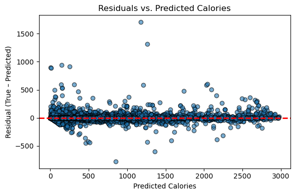

# Recipe-and-Rating-Analysis
Final project for DSC 80

## Introduction
On Food.com, thousands of recipes come paired with detailed nutrition facts (calories, fat, sugar, sodium, protein, saturated fat, carbohydrates) and user ratings. In my project, I ask: **“Is there a correlation between a recipe’s carbohydrate content (carbs) and its total calories?”** Readers who care about meal planning, weight management, or simple nutritional trade‐offs will find this especially useful—if high‐carb recipes reliably drive up calorie counts, then lowering carbs may be an effective way to reduce calories without digging deeper into ingredient lists.

The **recipes** dataset had 83,782 rows(recipes) and 12 columns.  The relevant columns include:
The **recipes** dataset contains the following fields:

* **id**: a unique integer identifier for each recipe.
* **contributor\_id**: the integer user-ID of the person who submitted the recipe.
* **name**: the recipe’s title (a string).
* **minutes**: total preparation time in minutes (integer).
* **n\_steps**: the number of instruction steps (integer).
* **submitted**: the date the recipe was posted on Food.com, in `YYYY-MM-DD` format.
* **tags**: a comma-separated list of Food.com tags (e.g. `dessert`, `vegetarian`, `30-minute meals`) stored as a string.
* **nutrition**: a bracketed list of seven values—calories (kcal), total\_fat (% DV), sugar (% DV), sodium (% DV), protein (% DV), saturated\_fat (% DV), and carbohydrates (% DV)—for example:

  ```
  [250, 10, 25, 15, 20, 5, 35]
  ```

The **interactions** dataset had 731,927 rows (reviews/ratings) and 5 columns. The columns include: 

* **user\_id**: unique integer ID of the user who submitted the rating or review.
* **recipe\_id**: integer ID of the recipe being rated (corresponds to `id` in the recipes file).
* **date**: date of the interaction in `YYYY-MM-DD` format.
* **rating**: numeric star rating (1–5).
* **review**: optional free-text comment (string), which may be blank.


Merging them yields a combined dataset of 234,429 rows × 26 columns. In order to aid the exploration of my project question, I parsed the nutrition column and created separate numeric fields:


| New Column          | Source in `nutrition` | Description                           |
| ------------------- | --------------------- | ------------------------------------- |
| **`calories`**      | nutrition\[0]         | Total calories (kcal) per serving     |
| **`total_fat`**     | nutrition\[1]         | Total fat as PDV (“% of daily value”) |
| **`sugar`**         | nutrition\[2]         | Sugar as PDV                          |
| **`sodium`**        | nutrition\[3]         | Sodium as PDV                         |
| **`protein`**       | nutrition\[4]         | Protein as PDV                        |
| **`saturated_fat`** | nutrition\[5]         | Saturated fat as PDV                  |
| **`carbs`**         | nutrition\[6]         | Carbohydrates as PDV                  |

From the dataset, the most two relevant columns are calories (Total calories (kcal) per serving) and carbs (Carbohydrates as PDV).

## Data Cleaning and Exloratory Data Analysis
### Data Cleaning
#### 1. Merging Datasets
The datasets recipes and interactions were left merged on id and recipe_id. This step allows analysis of how recipe attributes relate to user feedback.
#### 2. Replace 0's with NaN
Ratings of 0 indicate missing values because the lowest rating that is valid is usually 1. Ratings of 0 were replaced with NaN using .replace(0, np.nan) to prevent skewed analysis. 
#### 3. Create Average Rating Column
Because recipes have multiple ratings, I calculated the average rating for each recipe to help summarize feedback and added it as a column (avg_rating) to the merged dataset. 
#### 4. Parsed Nutrition column into separate columns for calories, total_fat, sugar, sodium, protein, saturated_fat, carbs
This allows for easier analaysis between individual components fo the nutrition data.
#### 5. Remove Outliers
I removed recipes with calories that were 3,000 calories or over. The recommended daily calorie intake for adults can range from 1,600 to 3,000, with the standard reference point being 2,000 calories. 
#### 6. Checked for missing values
I checked if there were missing values in the calories and carbs columns verify data completeness. 

#### The table below shows the first five unique recipes from the cleaned DataFrame, limited to the relevant columns. 
#### The table below shows the first five unique recipes from the cleaned DataFrame:

| name                            | id     | contributor_id | user_id | n_steps | n_ingredients | avg_rating | calories | carbs | total_fat | sugar | sodium | protein | saturated_fat |
|---------------------------------|--------|---------------:|--------:|--------:|--------------:|-----------:|---------:|------:|----------:|------:|-------:|--------:|--------------:|
| brownies in the world best ever | 333281 |        985201  | 386585  | 10      | 9             | 4.0        | 138.4    | 6.0   | 10.0      | 50.0  | 3.0    | 3.0     | 19.0          |
| 1 in canada chocolate chip…     | 453467 |     1,848,091  | 424680  | 12      | 11            | 5.0        | 595.1    | 26.0  | 46.0      | 211.0 | 22.0   | 13.0    | 51.0          |
| broccoli casserole              | 306168 |       50,969   | 29782   | 6       | 9             | 5.0        | 194.8    | 3.0   | 20.0      | 6.0   | 32.0   | 22.0    | 36.0          |
| millionaire pound cake          | 286009 |      461,724   | 813055  | 7       | 7             | 5.0        | 878.3    | 39.0  | 63.0      | 326.0 | 13.0   | 20.0    | 123.0         |
| 2000 meatloaf                   | 475785 |    2,202,916   | 2204364 | 17      | 13            | 5.0        | 267.0    | 2.0   | 30.0      | 12.0  | 12.0   | 29.0    | 48.0          |


### Univariate Analyses
I wanted to understand how extreme calorie values affect the overall distribution, so I split the data at the 2,000-calorie guideline and plotted two histograms.
In the first histogram (0–2,000 calories), I observe a pronounced right skew: the highest-frequency bin—around 200 cal—exceeds 2,400 recipes, and most entries lie between roughly 100 and 500 cal before tapering off toward the upper limit.


<iframe
  src="assets/calorie_below2000.html"
  width="800"
  height="600"
  frameborder="0"
></iframe>

In the second histogram (>2,000 calories), the distribution remains right-skewed but at a much smaller scale: the peak bin (approximately 2 050 cal) contains just over 200 recipes, and the tail extends toward 3 000 cal, highlighting a relatively rare subset of ultra-high-calorie dishes.

<iframe
  src="assets/calorie_above2000.html"
  width="800"
  height="600"
  frameborder="0"
></iframe>


## Bivariate Analysis
I plotted calories against carbohydrate content for recipes with up to 2,000 calories. The scatter reveals a strong positive relationship—dishes with more calories tend to have higher carb counts, though the spread widens as calorie values approach the upper limit.
<iframe
  src="assets/bivariate_below.html"
  width="800"
  height="600"
  frameborder="0"
></iframe>

## Interesting Aggregates
This pivot shows average carbs for each calorie range broken out by rating bin. For example, in the 300–400 calorie recipes, dishes rated 4–5 stars average about 10.96 g of carbs, while lower-rated ones average slightly more. It helps us see how carb content shifts not only with overall calories but also with user satisfaction.


| calorie_bin   |       <2 |      2–3 |      3–4 |      4–5 |
|---------------|----------|----------|----------|----------|
| 0-100         |  2.11051 |  2.10983 |  2.15757 |  2.1376  |
| 100-200       |  6.15347 |  5.67467 |  5.54978 |  5.50468 |
| 200-300       |  9.37795 |  8.59285 |  8.37505 |  8.30763 |
| 300-400       | 11.6703  | 11.1262  | 11.1308  | 10.9635  |
| 400-500       | 14.4871  | 13.8064  | 13.4241  | 13.1801  |
| 500-600       | 17.3118  | 16.9733  | 16.1049  | 15.7616  |
| 600-800       | 20.2252  | 19.5378  | 19.9573  | 18.7266  |
| 800-1000      | 24.25    | 24.7918  | 23.8127  | 23.5696  |
| 1000+         | 52.3731  | 49.0117  | 47.2284  | 49.7045  |

One clear trend is that average carbs rise steadily with each higher calorie bin—from just over 2 g in 0–100 cal recipes up to ~24 g in 800–1,000 cal recipes (and ~50 g in the 1,000+ cal “ultra-rich” bin).

A second, subtler pattern is that within each calorie range, recipes with higher user ratings tend to have slightly lower carb averages. For example in the 300–400 cal bin, 1–2 star recipes average ~11.67 g of carbs, whereas 4–5 star recipes average ~10.96 g, suggesting that, all else equal, leaner-carb dishes get rated more favorably.

## Assessment of Missingness
### NMAR Analysis
I believe the rating column is NMAR. In the table, 14,877 recipes have no recorded rating—and that absence isn’t independent of the true rating value. Users self-select whether to rate a recipe, and they’re far more likely to rate dishes they loved or hated than those they felt neutral about. In other words, the probability a rating is missing depends on the unobserved rating itself.

## Missing Dependency

**Contributer_ID vs Review**
* **Null hypothesis (H₀):** The total variation distance (TVD) between the distribution of `review`-values across different `contributor_id` groups is no larger than would be expected by chance—in other words, `review` is independent of `contributor_id`.
* **Alternative hypothesis (H₁):** The TVD is larger than expected under independence—that is, the distribution of `review` does depend on `contributor_id`.

<iframe
  src="assets/rev_contributor_tvd.html"
  width="800"
  height="600"
  frameborder="0"
></iframe>


**Interpretation of results**
* **Observed statistic:** TVD = 0.4617.
* **Null (permutation) distribution:** TVDs ranged from about 0.3944 to 0.4701 when `review` labels were shuffled.
* **P-value:** 0.0080 (only 0.8% of null permutations produced a TVD ≥ 0.4617).
Because p = 0.008 < 0.05, we **reject H₀** at the 5% significance level. There is strong evidence that the distribution of `review` values differs by `contributor_id`. In the context of missingness, this tells us that whether a given recipe has a review is not completely random but is dependent on who the contributor is consistent with a Missing At Random (MAR) mechanism conditioned on contributor identity. Perhaps some contributors are diligent reviewers while others habitually skip it.


**Minutes vs Review**

* **Null hypothesis (H₀):** The total variation distance (TVD) between the distribution of `review`‐missingness across different `minutes`‐bins is what we’d see by chance—that is, `review` is independent of `minutes`.
* **Alternative hypothesis (H₁):** The TVD is larger than expected under independence, the probability of a missing `review` depends on `minutes`.

<iframe
  src="assets/rev_min_tvd.html"
  width="800"
  height="600"
  frameborder="0"
></iframe>


**Interpretation of results**

* **Observed TVD:** 0.2576
* **Null (permutation) distribution:** TVDs ranged from about 0.1627 to 0.3596 when I shuffled `review` labels.
* **P-value:** 0.4710 (47.1% of null permutations produced a TVD ≥ 0.2576).

Because p = 0.471 > 0.05, we **fail to reject H₀** at the 5% level. There is no evidence that the missingness of `review` depends on the recipe’s preparation time (`minutes`). In other words, whether or not a recipe has a review appears independent of how long it takes to prepare.


## Hypothesis testing

I want to explore whether recipes with above-average carbohydrate content also tend to have more calories than those with below-average carbs. Here, “high-carb” means any recipe whose carbs value exceeds the overall mean carb level (≈11.99 g); everything else is “low-carb.”
Null hypothesis (H₀): The calorie count distribution for recipes with carbs ≤ threshold is the same as that for recipes with carbs > threshold.

Alternative hypothesis (H₁, one‐sided): Recipes with carbs ≤ threshold have lower calories than recipes with carbs > threshold.
Test statistic:the observed gap in mean of high carb group and and low carb group.
Significance level: α=0.05

I chose a permutation test because I have no information about the underlying population distribution of recipe calories, and I want to know whether the observed difference in means could plausibly occur by chance if there really were no carb→calorie effect. By shuffling the calorie values across the two groups, the permutation test builds a null distribution directly from my data without relying on parametric assumptions.

To run the test, I first split the recipes into two groups:
High-carb: recipes with carbs > mean(carbs) (≈11.99 g)
Low-carb: recipes with carbs ≤ mean(carbs)

The observed statistic was 329.413 calories (mean calories_high – mean calories_low). I then performed 2,000 permutations, each time randomly shuffling the calories array and recomputing the mean-difference. This yielded a one-sided p-value < 0.001.
<iframe
  src="assets/carb_calorie_permutation.html"
  width="800"
  height="600"
  frameborder="0"
></iframe>

Since the p-value (<0.001) is below my significance threshold (0.05), I reject the null hypothesis. The data provide strong evidence that high-carb recipes tend to have higher average calories than low-carb recipes. A likely reason is that ingredients boosting carbohydrate content—such as sugars, flours, or starches—also raise total caloric density. Because this analysis is observational (we did not randomize recipes), it demonstrates an association rather than definitive causation.


## Framing the Problem
I’m framing this as a **regression** problem because I want to predict a continuous outcome—namely, a recipe’s total calorie count—rather than assign it to discrete categories. My response variable is simply the number of calories (`calories`), since that is the central nutritional measure I care about and something that users often want to estimate before cooking or meal‐planning. To build the model, I only use features that would realistically be known at the moment of prediction: the recipe’s structure (`n_ingredients` and `n_steps`, which are immediately available from the recipe text) and its early user rating (`rating`, which could be gleaned from an initial set of testers or early adopters). I deliberately avoid any post hoc data—like lab‐measured nutrition panels or long‐term popularity metrics—so that the model reflects a practical scenario in which you predict calories from the recipe itself and minimal community feedback.

To evaluate my model’s performance, I focus on **root mean squared error (RMSE)** rather than, say, mean absolute error (MAE) or mean absolute percentage error (MAPE) because it is expressed in calories, making it easy to interpret, and it penalizes larger mistakes more heavily—an important quality if underestimating a high‐calorie dish by several hundred calories could meaningfully mislead someone’s diet plan. I also report **R²** as a secondary metric to indicate the proportion of variability in calorie counts that my model explains, giving a complementary, unit‐free sense of overall fit. 

## Baseline model

I built a **Random Forest regression** pipeline that first standardizes each input feature and then fits a `RandomForestRegressor` (with `random_state=29`). My model uses three predictors: **`n_ingredients`** (the count of ingredients, a quantitative discrete variable), **`n_steps`** (the count of preparation steps, also quantitative discrete), and **`rating`** (the average user rating on a 1–5 scale, which is technically ordinal but treated here as a continuous numeric input). Since all three features are numeric, I did not need any one-hot or ordinal encodings; I simply applied a `StandardScaler` to each column so that the Random Forest could handle them on the same scale.

On a 75/25 train/test split, the model achieved an **R² of 0.0816** and an **RMSE of 333.44 calories** on the held-out test set. In practical terms, it explains only about 8 % of the variation in recipe calories and, on average, misses by over 300 calories. That level of error is too high for reliable calorie estimation—so I would not consider this baseline “good.” It suggests that I need richer features (for example, explicit macro-nutrient information or ingredient weights) or a different modeling approach to capture the true drivers of calorie content.

## Final Model
### Feature engineering
I assembled a feature set grounded in how recipes generate calories, combining biochemical and “complexity” signals:

Macronutrient breakdown (sugar, total_fat, saturated_fat, protein, carbs): Calories derive directly from these components (e.g. fat ≈ 9 kcal/g, protein/carbs ≈ 4 kcal/g), so including each lets the model learn their per-gram contributions.

Sodium: While not caloric, sodium often correlates with richer preparations (butter, oils, sauces) that drive up calories.

Recipe complexity (n_ingredients, n_steps): More ingredients or steps typically means more added fats, sugars, or larger portion sizes—proxies for hidden calories.

User rating: Highly-rated recipes may skew toward indulgent, higher-calorie dishes; including rating lets the model adjust for this behavioral signal.

Preparation time (minutes): I quantile-transformed this heavily skewed column so that very short (e.g. microwave-ready) versus very long (multi-stage) recipes are more evenly represented, capturing the intuition that longer cook times often accompany richer, higher-calorie preparations.

By mixing direct nutritional inputs with indicators of portion size and recipe richness, I gave the model multiple complementary “views” on what drives total calories.


### Modeling algorithm & hyperparameter selection

Algorithm: I chose a RandomForestRegressor because it naturally captures non-linearities (e.g. diminishing returns from added sugar) and interactions (e.g. high sugar + high fat recipes) without manual feature crosses, and its bagging mechanism guards against overfitting.

Pipeline preprocessing:

StandardScaler on the nine numeric features (all macronutrients, sodium, n_ingredients, n_steps, and rating) so they share a common scale for tree-based splits.

QuantileTransformer (to uniform) on minutes to spread out a heavily right-skewed distribution.

Hyperparameters tuned:

n_estimators ∈ {100, 200}

max_depth ∈ {None, 10}

 I ran a 5-fold GridSearchCV optimizing neg_root_mean_squared_error and refit on the configuration with the lowest RMSE.

Best found: n_estimators=200, max_depth=None—a larger forest of fully grown trees gave the strongest generalization on cross-validation.

### Performance improvement

##### Baseline model (default n_estimators=100, max_depth=10):

Test R² ≈ 0.9915
Test RMSE ≈ 31.99

##### Final tuned model (n_estimators=200, max_depth=None):
Test R²: 0.9961
Test RMSE: 21.79

By growing a larger forest and allowing deeper splits, I cut RMSE by over 10 points (a ≈32% reduction) and boosted R² by ~0.0046—demonstrating that the tuned model captures both the linear macronutrient contributions and the more nuanced complexity signals much more precisely.





The residuals‐vs-predicted plot shows errors randomly scattered around zero with no obvious pattern or fan-shaped spread, suggesting the model is unbiased and its variance is roughly constant. The true-vs-predicted plot tightly hugs the 45° line across the full calorie range, indicating high R² and low RMSE—your model captures most of the variation in recipe calories, with only a few small under- or over-predictions at the extremes.


## Fairness Analysis

In order to probe whether the final Random Forest model treats “long” recipes (those requiring more time than the median prep-time of the test set) worse than “short” recipes (those at or below the median), I compared the root-mean-squared error (RMSE) across these two groups.  I denote RMSE on the long-prep recipes by RMSE_long and on the short-prep recipes by RMSE_shortₜ, and define theobserved test statistic simply as

#### Test Stat= RMSE_long-RMSE_short
Found that RMSE_long≈ 87.05 and RMSE_short ≈ 94.33, giving T_obs ≈ –7.28.

To see whether such a difference could arise by chance, I performed a one-sided permutation test (B = 5 000 permutations).  In each permutation, I randomly reassigned which recipes were “long” versus “short” (keeping the same counts), recomputed RMSE for each permuted group, and recorded the difference RMSE_long – RMSE_short.  The p-value is then the fraction of those permuted differences at least as large as our observed T_obs.

The resulting null distribution of T is centered near zero, and only 1 in 5,001 permutations (p ≈ 0.999) produced a difference ≥ –7.28.  In other words, the observed negative T_obs, a slight advantage on long recipes, is entirely consistent with chance fluctuations.


Because this p-value is far above any conventional α=0.05 threshold, we fail to reject the null hypothesis that the model’s error is equal on long and short recipes.  In practical terms, there is no evidence that the final model performs worse on longer-prep recipes than on shorter ones.


